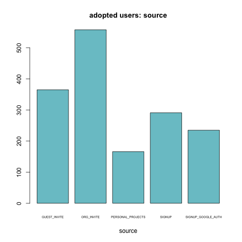
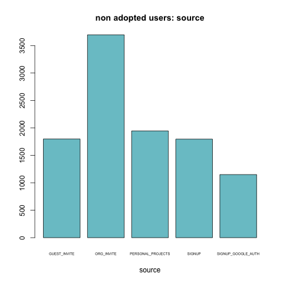
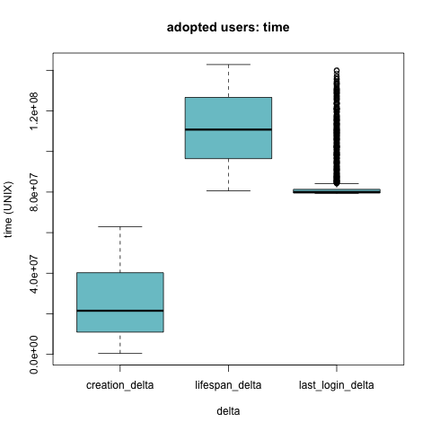
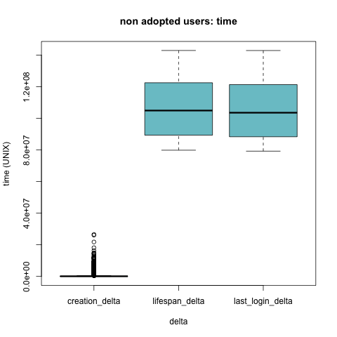

```{r setup, include=FALSE}
knitr::opts_chunk$set(echo = TRUE)
library(stargazer)
load('../data/linear-modeling.RData')
```

### Introduction

The goal of this assignment was to analyze data on users from Asana to identify which factors predict future user adoption. An "adopted user" is defined as a user who has logged into the produt on three separate days in at least one seven-day period.

### Analysis

To predict what factors lead to user adoption I created a multi variable linear regression model. I used an OSL Regression model and Figure 1 displays the table of coefficients of each predictor when regressed against `adopted_user`, which was a 1 if the user met the criteria for being considered adopted and 0 elsewise. Results are as follows.

#### Creation source

Since the creation source variable was a categorical variable, I dummied it out and matched each source against `GUEST_INVITE` since that creation source type had the highest correlation with `adopted_user`. We see that the other creation soucres have negative coefficient estimates with our response variable, indicating that `GUEST_INVITE` is more indicative of adoption than these other sources. When analyzing this further, I created a separate regression of `adopted_user` against these creation sources (Table 2). The coefficient estimate was most negative for personal projects at `r osl_summary_fit_source$coefficients[3]` and was minimally positively correlated with Google signups, but exhibited a p-value of close to 1, so we would not want to use this as a positive indicator.

#### Emails

User signup for mailing lists exhibited a positive correlation with user adoption. In analyzing further (Table 3), `enabled_for_marketing_drip` exhibited an estimate of `r osl_summary_fit_email$coefficients[3]`, only slightly higher than `opted_in_to_mailing_list`. But again, we see high p-values with these estimates. Thus from this model we cannot make any clear assumptions about the relationship between email marketing and user adoption.

#### Time Deltas

Time deltas are defined as follows: `creation_delta` = time from account creation to last login and `last_login_delta`: time from last login to when this report was created (12/9/16).

From the model, we see the coefficient estimates with the time delta variables. The `creation_delta` exhibited the highest value, with a p-value approximately 0 indicating almost perfect estimation. Exploring this relationship further, I regressed only the time deltas (Figure 4) against`adopted_user` and found that `creation_delta` has an estimate of `r osl_summary_fit_time$coefficients[2]` and that `last_login_delta` exhibits an estimate of `r osl_summary_fit_time$coefficients[3]`, indicating it has a slightly negative relationship with becoming an adopted user.

### Conclusions & Recommendations

In conclusion, from this data the best predictors of future user adoption is our `creation_delta` variable and the creation source to be `GUEST_INVITE`. Again, the creation delta variable was constructed as _the time from account creation to the user's last login_. Intuitively, this makes sense as users who have been using Asana for a longer span of time are more likely to use the product frequently. As users login more, they are likely to import more information and rely on the platform as a larger part of their day to day tasks, and thus are more likely to be "adopted." The other predictor variable was creation source as guest invite. Surprisingly personal projects as a creation source did not perform as well as I would have initially thought, but there may be something about the exclusivity and excitement of a friend or colleague inviting you to join the platform that is inticing.

Thus, conclusions would be as follows: get more guest invites sent and keep users logging in frequently (whether this be via push notification, email, or marketing advertisement). 

### Further Exploration

Given these results, my next step in analyzing this data would be to explore the relationship of invites/creation source further as well as organization usage. Some questions I have from the data are, _1) If a user was invited by another Asana user, what is the likelihood that a) that initial Asana user is an adopted user and b) that the new user becomes an adopted user?_ Another question I have is _2) Does the number of people in your organization make a difference in user adoption?_ (i.e. is there a tipping point of X amount of people in your organization are using Asana that a user will be default become an adopted user?)

---------------

### Figures

#### Least Squares Coefficient Estimates

```{r results='asis', echo=FALSE}
stargazer(osl_summary_fit$coefficients, title = 'Coefficient estimates: ALL', type='latex', header=FALSE)
```

```{r results='asis', echo=FALSE}
stargazer(osl_summary_fit_source$coefficients, title = 'Coefficient estimates: Source', type='latex', header=FALSE)
```

```{r results='asis', echo=FALSE}
stargazer(osl_summary_fit_email$coefficients, title = 'Coefficient estimates: Email', type='latex', header=FALSE)
```

```{r results='asis', echo=FALSE}
stargazer(osl_summary_fit_time$coefficients, title = 'Coefficient estimates: Time Deltas', type='latex', header=FALSE)
```

#### Creation

These first figures represent barplots of the relative frequencies of `creation_source`, broken up by adopted users versus non-adopted users.

```{r, out.width = "200px", echo=FALSE, fig.align="center, fig.show='hold'"}


```

#### Time Deltas

The figures below are boxplots of time deltas. Time deltas are defined as follows: `creation_delta` = time from account creation to last login, `lifespan_delta` = time from signup to when this report was created (12/9/16), and `last_login_delta`: time from last login to when this report was created (12/9/16).

```{r, out.width = "200px", echo=FALSE, fig.align="center, fig.show='hold'"}


```
